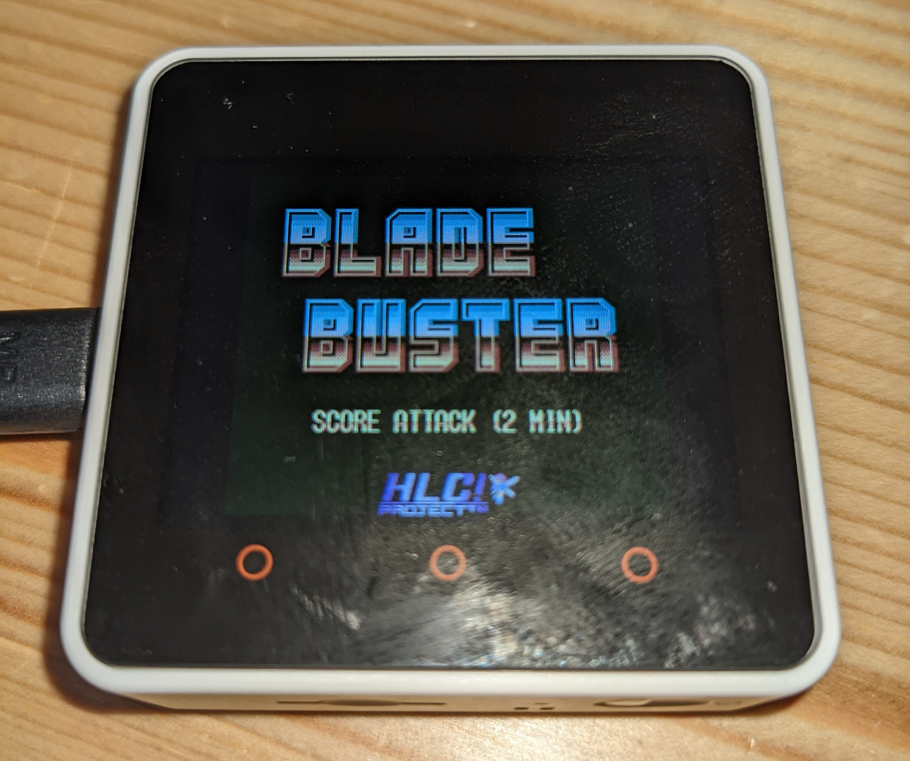

# M5Stack NESをM5 Core2に移植する

## TL;DR

M5Stack Core2でファミコン(NES)エミュレータを動かしたい。  
移植元がESP-IDF前提なので、勉強がてら動かしたい。


## 移植元の情報

M5Stack NESエミュレータ [https://github.com/m5stack/M5Stack-nesemu.git](https://github.com/m5stack/M5Stack-nesemu.git)\
M5Core2 on ESP-IDF(No Arduino)  [https://github.com/ropg/m5core2\_esp-idf\_demo](https://github.com/ropg/m5core2\_esp-idf\_demo)\
M5Core2 on ESP-ADF(No Arduino) [https://github.com/ropg/m5core2\_adf](https://github.com/ropg/m5core2\_adf)


## ハード的な違い

M5 Core2: [http://docs.m5stack.com/en/core/core2](http://docs.m5stack.com/en/core/core2)\
M5 Stack: [https://docs.m5stack.com/en/core/basic](https://docs.m5stack.com/en/core/basic)

回路図を眺めてみる。コアのESP32コアは一緒。\
PMU(Power Management Unit): AXP192が追加されている。I2Cで制御する模様。\
これらでLCDとか周辺機器の電源やリセットを制御してあげないとうんともすんとも言わない。\
さらに静電タッチIC: T6336Uも追加されている。これらは下記I2Cでつながっている。\
RTC(Real Time Clock): BM8563, IMU(ジャイロ・加速度センサー): MPU6886は未調査​

<figure><figcaption></figcaption></figure>

さらにスピーカーは外付けDAC：NS4168になっている。これはI2S制御。  

<figure><figcaption></figcaption></figure>


元のNESエミュレータはメーカー（Espressif）が公開しているものがベースになっているが、\
ESP-IDF v3.3と古い。なので、ESP-IDF v4.3(2022/10/2)時点の最新を持ってくる。

```
$ git clone -b v4.3.4 --recursive https://github.com/espressif/esp-idf.git esp-idf-v4.3.4
```

本家(espressif)の[インストール手順](https://docs.espressif.com/projects/esp-adf/en/latest/get-started/index.html)を参考に下記スクリプトで必要なパッケージと環境を入れる。

```
$ cd esp-idf-v4.3.4/
$ ./install.sh
$ . export.sh
```

## ベース環境

PMU制御を一から作るのは骨が折れる。M5 Core2をESP-IDFで動かしている環境があったのでこれをベースにすることにする。

```
$ cd ../
$ git clone --recursive https://github.com/ropg/m5core2_esp-idf_demo.git
$ cd m5core2_esp-idf_demo
$ idf.py build flash monitor
```

動作確認してみたがタッチが聞かない。おかしい。\
ESP\_LOGI()を埋め込んでデバッグする。どうもI2Cでタッチはきているが値が無茶苦茶である。\
下記バースト転送に問題がありそうだ。正直波形を見ないとわからない。

```
lvgl_touch/ft6x36.c

esp_err_t ret = lvgl_i2c_read(CONFIG_LV_I2C_TOUCH_PORT, current_dev_addr, FT6X36_TD_STAT_REG, &data_buf[0], 5);
```

個別でリードするように修正。とりあえずforkしてパッチを充てた。[https://github.com/HidetoKimura/lvgl\_esp32\_drivers/commit/c3527874132d70ca9c0f4f17dec265c072b6e7bd](https://github.com/HidetoKimura/lvgl\_esp32\_drivers/commit/c3527874132d70ca9c0f4f17dec265c072b6e7bd)\


タッチも動いたのでここにNESエミュレータ(nofrendo)をぶち込む。\
本家(espressif)の[コンポーネント追加手順](https://docs.espressif.com/projects/esp-idf/en/v4.3.4/esp32/api-guides/build-system.html?highlight=component)を参考にとりあえず無理やりビルドを通す。\
[https://github.com/HidetoKimura/m5core2\_esp-idf\_nesemu/commit/d91013f58b65a80453b7fd751fdcf75f42a50f7c](https://github.com/HidetoKimura/m5core2\_esp-idf\_nesemu/commit/d91013f58b65a80453b7fd751fdcf75f42a50f7c)

## 調査、修正

まずはコンフィグを色々直す。linux kernel風のmenuconfigがあってかなり便利。

```
$ idf.py menuconfig
```

<figure><figcaption></figcaption></figure>

パーティションテーブルを有効化する。0x100000にNESのロムは置く。あとはLCDのポートをM5 Core2にあわせて直す。

```
+# Partition Table
+#
+# CONFIG_PARTITION_TABLE_SINGLE_APP is not set
+# CONFIG_PARTITION_TABLE_TWO_OTA is not set
+CONFIG_PARTITION_TABLE_CUSTOM=y
+CONFIG_PARTITION_TABLE_CUSTOM_FILENAME="partitions.csv"
+CONFIG_PARTITION_TABLE_FILENAME="partitions.csv"
+CONFIG_PARTITION_TABLE_OFFSET=0x8000
+CONFIG_PARTITION_TABLE_MD5=y
+# end of Partition Table

+# Nofrendo ESP32-specific configuration
+#
+# CONFIG_HW_WROVERKIT_V1 is not set
+# CONFIG_HW_WROVERKIT_V2 is not set
+CONFIG_HW_CUSTOM=y
+CONFIG_HW_LCD_TYPE_ILI=y
+# CONFIG_HW_LCD_TYPE_ST is not set
+CONFIG_HW_LCD_TYPE=0
+CONFIG_HW_LCD_MISO_GPIO_CUST=38
+CONFIG_HW_LCD_MOSI_GPIO_CUST=23
+CONFIG_HW_LCD_CLK_GPIO_CUST=18
+CONFIG_HW_LCD_CS_GPIO_CUST=5
+CONFIG_HW_LCD_DC_GPIO_CUST=15
+CONFIG_HW_LCD_RESET_GPIO_CUST=1
+CONFIG_HW_LCD_BL_GPIO_CUST=1
+# CONFIG_HW_INV_BL_CUST is not set
+CONFIG_HW_LCD_MISO_GPIO=38
+CONFIG_HW_LCD_MOSI_GPIO=23
+CONFIG_HW_LCD_CLK_GPIO=18
+CONFIG_HW_LCD_CS_GPIO=5
+CONFIG_HW_LCD_DC_GPIO=15
+CONFIG_HW_LCD_RESET_GPIO=1
+CONFIG_HW_LCD_BL_GPIO=1
+CONFIG_SOUND_ENA=y

# CONFIG_ESP_TASK_WDT is not set
```

```
partitions.csv

# Name,   Type, SubType, Offset,  Size
# Note: if you change the phy_init or app partition offset, make sure to change the offset in Kconfig.projbuild
nvs,      data, nvs,     0x9000,  0x6000
phy_init, data, phy,     0xf000,  0x1000
factory,  app,  factory, 0x10000, 0x0E0000
nesgame,  0x40, 0x01,    0x100000, 0x300000
```

ROMを書き込む。ここでは個人の方が無料で公開している著作権的に問題がないものをつかう。\
portは各自環境で違うかもしれない。

```
$ esptool.py --chip esp32 --port /dev/ttyACM0 --baud 921600 --before default_reset --after hard_reset write_flash -z --flash_mode dio --flash_freq 40m --flash_size detect 0x100000 BladeBuster.nes
```

次にLCD制御をなんとかする。ILI9342というデバイスをSPIで制御している。\
データシートからレジスタを調べ、最小構成で動いている確認する。\
動いているM5 Core2のドライバを読み解き、とりあえず矩形が書けるかを見る。

```
components/nofrendo-esp32/spi_lcd.c

    uint8_t data[] = {0x08, 0x88, 0x28, 0xE8};
    lcd_cmd(spi, 0x36);//縦置き：ポートレートモードにする。デバイスの向きがこうなっているっぽい。
    lcd_data(spi, (void *) &data[0], 1);

    lcd_cmd(spi, 0x21);//インバートする。これはILI9342ではデフォルト反転いるらしい。

	for(int y = 0; y < 16; y++) {
		for(int x = 0; x < 16; x++) {
			test_bmp[y][x * 2] 		= 0x00; // BBBB BGGG 
			test_bmp[y][x * 2 + 1] 	= 0x1F; // GGGR RRRR
		}
	} 

    lcd_cmd(spi, 0x2C);
    lcd_data(spi, test_bmp, 512);//適当な座標に赤い矩形を書く
```

ほぼ同じコードにもかからずnofrendoのドライバからは絵がでない。\
SPIのドライバでログをみたがまったく同じ手順。\
CS(Chip Select)やDC(Data Command)が動いていないじゃないかと疑う。\
結果的にはマルチプレクサピンがGPIOになっていなかった。

```
components/nofrendo-esp32/spi_lcd.c

    //Initialize non-SPI GPIOs
    gpio_pad_select_gpio(PIN_NUM_DC); // マルチプレクサをGPIOにする
    gpio_set_direction(PIN_NUM_DC, GPIO_MODE_OUTPUT);
```

画面がでたー。かなりうれしい。しかしコントローラも何もないので先にすすまない。\
タッチで簡単なコントローラを作るか。\


画面を九分割して下記のように割り当てる。あとはエリア判定してイベントを通知する。\
既存の処理をパクリながらイベント通知は実装。

<figure><figcaption></figcaption></figure>

最後に音を出す。内蔵DACが外付けになっているので、ちょっと初期化を修正。

```
components/nofrendo-esp32/video_audio.c

static int osd_init_sound(void)
{
	audio_frame = malloc(2 * DEFAULT_FRAGSIZE);
	i2s_config_t cfg = {
/		.mode = I2S_MODE_DAC_BUILT_IN | I2S_MODE_TX | I2S_MODE_MASTER,
		.mode = I2S_MODE_TX | I2S_MODE_MASTER,
		.sample_rate = DEFAULT_SAMPLERATE,
		.bits_per_sample = I2S_BITS_PER_SAMPLE_16BIT,
		.channel_format = I2S_CHANNEL_FMT_ONLY_RIGHT,
//		.communication_format = I2S_COMM_FORMAT_I2S_MSB,
		.communication_format = I2S_COMM_FORMAT_STAND_I2S,
		.intr_alloc_flags = 0,
		.dma_buf_count = 2,
		.dma_buf_len = 512
	};

	i2s_pin_config_t pin_cfg = {
        .bck_io_num = GPIO_NUM_12,
        .ws_io_num = GPIO_NUM_0,
        .data_out_num = GPIO_NUM_2
	};

	i2s_driver_install(I2S_NUM_0, &cfg, 2, &queue);
	i2s_set_pin(I2S_NUM_0, &pin_cfg);	
```

なんか音が大きいので調整

```
do_audio_frame() {
//			audio_frame[i] = audio_frame[i] + 0x8000;
			audio_frame[i] = audio_frame[i] / 5;
```

## 成果

めでたくゲームができるレベルにはなりました。

<figure><figcaption></figcaption></figure>

\
ちょっとまだ要調査のところは残っていますが、PoCとしては十分かと。\
[\
https://github.com/HidetoKimura/m5core2\_esp-idf\_nesemu](https://github.com/HidetoKimura/m5core2\_esp-idf\_nesemu)

```
$ git clone -b v4.3.4 --recursive https://github.com/espressif/esp-idf.git esp-idf-v4.3.4
$ cd esp-idf-v4.3.4/
$ ./install.sh # 一回だけ。
$ . export.sh
$ git clone --recursive https://github.com/HidetoKimura/m5core2_esp-idf_nesemu.git
$ cd m5core2_esp-idf_nesemu
$ ./flash.sh # NES ROMを書く。一回だけ。
$ idf.py build flash monitor
```


